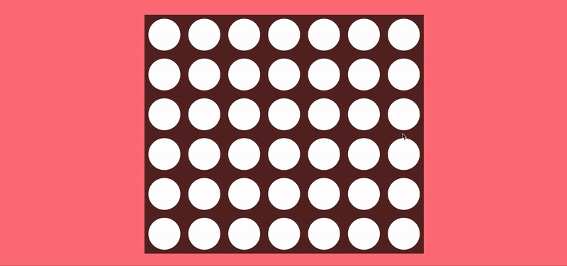

# about

Connect Four is a two-player connection game. The winner is the first player to form a horizontal, vertical, or diagonal line of four discs.

# technologies

- Javascript
- HTML
- CSS

# play it here:

https://ingriddorioschulze.github.io/connect-four/
